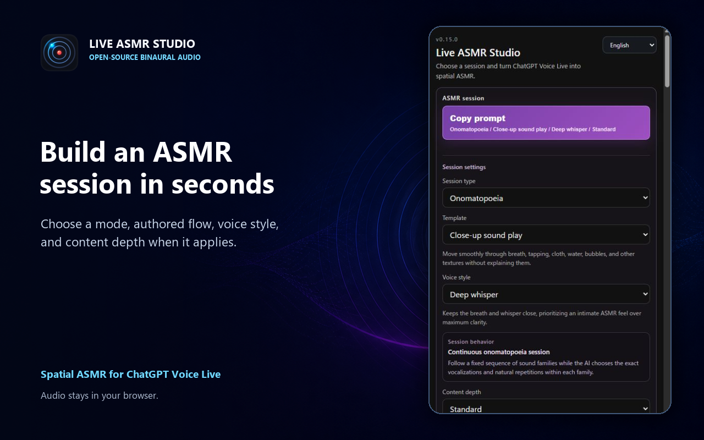
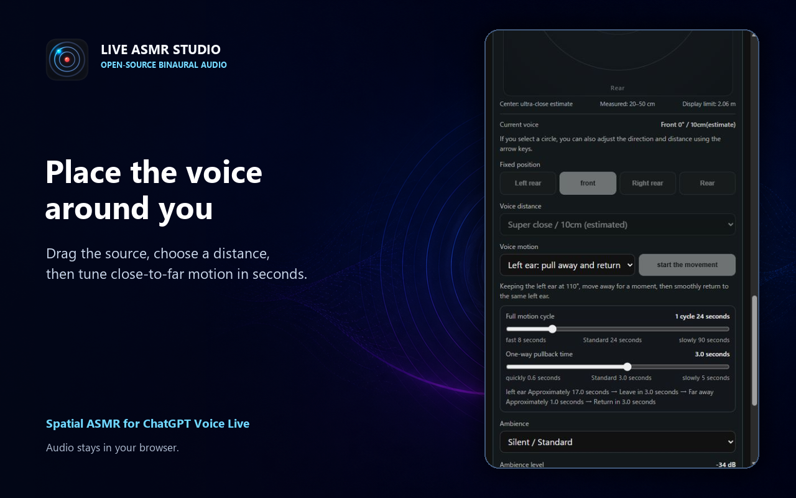
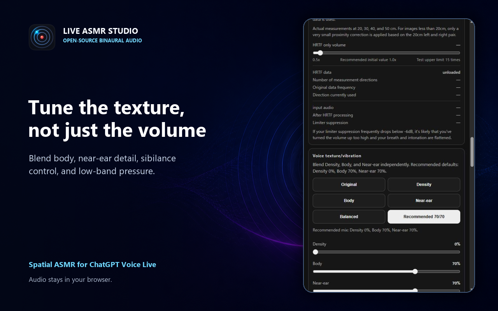

# Live ASMR Studio

Spatial ASMR audio for ChatGPT Voice Live, processed locally in a Chromium browser extension.

Live ASMR Studio turns the audio from the tab you choose into a binaural listening session. It combines measured near-field HRTF positioning, smooth motion, voice texture controls, low-band pressure, room ambience, and reusable session prompts. The extension is free and open source.

**[Download Live ASMR Studio v0.15.0](https://github.com/ugin-man/live-asmr-studio/releases/latest/download/live-asmr-studio-v0.15.0.zip)**

## Features

- Measured Aalto University near-field HRTF data bundled with the extension
- Draggable top-down position map with front, rear, left, right, and distance controls
- Smooth behind-the-head, orbit, alternating-ear, near-to-far return, and random motion patterns
- Voice texture, low-band pressure, early reflections, ambience, and output gain controls
- Deterministic session modes for conversation, sleep, focus, role-play, spoken onomatopoeia, and imported text
- English, Japanese, Simplified Chinese, Korean, and Spanish UI and prompts
- Local settings export and import
- No recording, analytics, ads, or extension-operated server

## Requirements

- Google Chrome or Brave 116 or later
- Stereo headphones or earphones
- Access to ChatGPT Voice Live

Headphones can become dangerously loud at high gain. Start with the device volume low. The peak limiter reduces clipping; it is not hearing protection.

## Preview







## Install a release

1. Download [live-asmr-studio-v0.15.0.zip](https://github.com/ugin-man/live-asmr-studio/releases/latest/download/live-asmr-studio-v0.15.0.zip) from the latest GitHub release.
2. Extract the ZIP to a permanent folder. Keep this folder for future updates.
3. Open `chrome://extensions` or `brave://extensions`.
4. Enable Developer mode.
5. Choose **Load unpacked** and select the extracted folder.
6. Pin Live ASMR Studio to the toolbar.

To update later, replace the files in that same folder with the new release, then press **Reload** on the extension card.

## Install from source

1. Download or clone this repository.
2. Open `chrome://extensions` or `brave://extensions`.
3. Enable Developer mode.
4. Choose **Load unpacked** and select the `extension` folder.
5. Pin Live ASMR Studio to the toolbar.

## Use

1. Open ChatGPT Voice Live.
2. Choose a session and copy its prompt if you want guided ASMR speech.
3. Paste the prompt into the conversation and start the voice response.
4. Keep that tab active and click the Live ASMR Studio toolbar icon.
5. Adjust the sound, position, movement, and ambience in the side panel.

The extension only captures the tab selected by a direct toolbar click. It does not capture microphone audio.

## Development

Run the checks from the repository root:

```powershell
node scripts/test_localization.js
node scripts/test_session_prompt_config.js
node scripts/test_background_capture.js
node scripts/test_v071_ambience.js
python scripts/package_extension.py
```

The packaging script writes `packages/live-asmr-studio-v<version>.zip` for a GitHub release. Historical development notes remain in [extension/CHANGELOG.md](extension/CHANGELOG.md).

## Privacy and support

- [Privacy policy](docs/privacy.md)
- [Support](docs/support.md)
- [Contributing](CONTRIBUTING.md)
- [Security policy](SECURITY.md)

## License

The extension source is available under the [MIT License](LICENSE). The bundled Aalto HRTF dataset is licensed separately under CC BY 4.0. See [third-party notices](extension/THIRD_PARTY_NOTICES.md).

Live ASMR Studio is an independent project. It is not affiliated with, endorsed by, or sponsored by OpenAI. ChatGPT is a trademark of OpenAI.

---

## 日本語

Live ASMR Studioは、選択したChatGPT Voice Liveタブの音声を、ブラウザ内だけでバイノーラルASMRへ加工する無料のオープンソース拡張機能です。実測近距離HRTF、円形の位置操作、自然な音の移動、声の質感、低域圧、環境音、セッション用プロンプトをまとめて使えます。

導入は、[最新版のZIP](https://github.com/ugin-man/live-asmr-studio/releases/latest/download/live-asmr-studio-v0.15.0.zip)をダウンロードして展開し、`chrome://extensions` または `brave://extensions` でデベロッパーモードを有効にして、その展開先を「パッケージ化されていない拡張機能」として読み込んでください。更新時は同じフォルダの中身を新しい版へ置き換え、拡張機能カードの「再読み込み」を押すだけです。使うときはChatGPT Voice Liveのタブを前面にして、ツールバーの拡張機能アイコンを押します。

音声は録音、保存、外部送信しません。詳しくは[プライバシーポリシー](docs/privacy.md#日本語)を確認してください。
